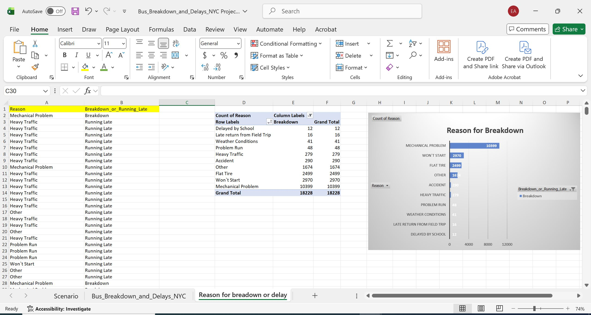
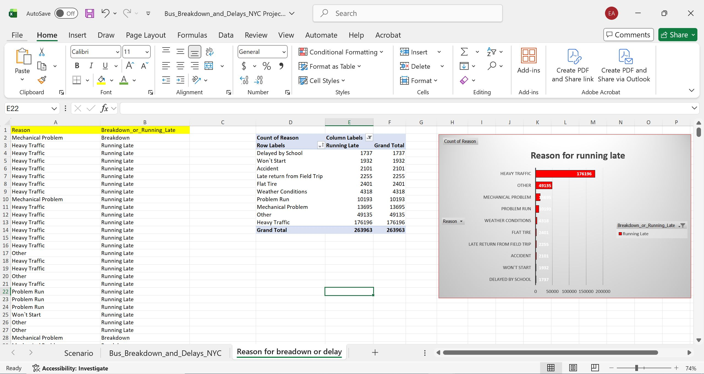
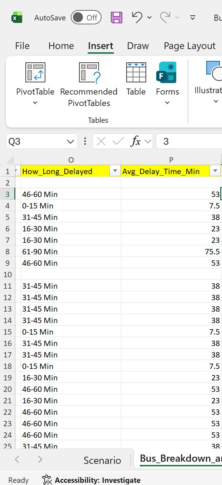
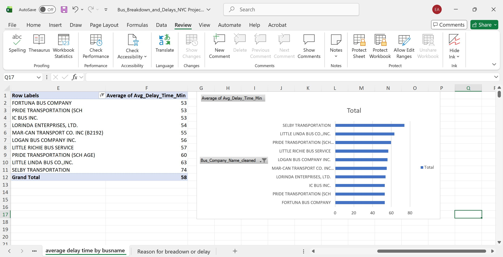

# Identifying Patterns in Bus Breakdowns and Delays Using MS Excel

## Table of Contents
1. [Data Source](#data-source)
2. [Tools](#tools)
3. [Objective(s)](#objectives)
4. [Questions](#questions)
5. [Data Preparation and Cleaning](#data-preparation-and-cleaning)
6. [Answer & Findings to Question 1](#answer--findings-to-question-1)
7. [Answer & Findings to Question 2](#answer--findings-to-question-2)

## Data Source
- The `Bus_Breakdown_and_Delays_NYC Project (1)` file from **Alextheanalyst**, attached to the files in this project.

## Tools
- MSExcel

## Objective(s)
- The New York Division of Transportation has asked for our help to improve the efficiency and reliability of the city's bus transport system.
  The city is experiencing numerous breakdowns and delays, causing significant inconvenience to commuters. My objective is to analyze the data and identify patterns that contribute to these breakdowns and delays.

## Questions
1. What are the common reasons for delays and breakdowns?
2. How do delay times vary by bus company and borough?

## Data preparation and cleaning
- the column Occured_on has the data accidents or delays occured in a
mm/dd/yyyy HH:MM format, for easier analysis, I created another
column by the right and made the theme color yellow, I named this
column Day_occured, where (1 is sunday and 7 is saturday), therefore,
9/1/2022 is 5 and 9/2/2022 is 6 and so on.

  

-  In the excel file we have a column called Bus_Company_name which contained a lot of unstandardised data, and beside it I opened another column called Bus_Company_name_cleaned
   which is a replica of Bus_Company_name, only this time, its data are standardised.

   
   
- In the before image, Under Bus_company_name we had entries like (CONSOLIDATED BUS TRANS. INC.
& CONSOLIDATED BUS TRANSIT, INC.), (Don Thomas Buses, DON THOMAS BUSES, INC.(B2321)),
(FIRST STEPS TRANS INC. (B2192) & FIRST STEPS TRANS, INC) AND 
(G.V.C. LTD. (B2192) & G.V.C., LTD.) which were all converted to 
(CONSOLIDATED BUS TRANS. INC.), (DON THOMAS BUSES, INC), (FIRST STEPS TRANS, INC) and
(GVC LTD) in the after image under the Bus_Company_name_cleaned column.

  
` 

## Answer & Findings to Question 1
- To understand the reasons for delays and breakdowns, I moved the "Reasons" column and the "Breakdown_or_running_late" column to a new sheet. I categorized the "Reasons" column for breakdown data to determine the most common causes. As shown in the image, there are 10,399 occurrences of breakdowns due to mechanical problems, making this the leading cause of breakdowns. To address this, the government should implement routine and periodic servicing of buses.

  

- I further categorized the "Reasons" column for "Running_Late" data to identify the most common causes for delays. It's clear from the image below that 176,196 delays were due to heavy traffic. To solve this, the government could explore alternative routes or adjust bus schedules to avoid peak rush hours.

  

## Answer & Findings to Question 2
- I used the following formula to calculate the average delay time in minutes:
  
  ```excel
  =IF(O2<>"", (VALUE(LEFT(O2,FIND("-",O2)-1)) + VALUE(MID(O2,FIND("-",O2)+1,FIND(" ",O2)-FIND("-",O2)-1)))/2, "")

This formula sums the values in column O (e.g., 46-60 Min), divides by 2 to get the average, and removes the text "Min." For example, if O3 contains "46-60 Min," the result in P3 will be 53 (i.e., (46 + 60) / 2 = 53).

   

I then created a pivot table and bar chart for the columns "Borough" and "Average of Avg_Delay_Time_min," which shows that Manhattan has the highest delay times. 
The government should consider expanding and building more roads in this borough to alleviate traffic congestion.

  
  
- Similarly, I created a pivot table and bar chart for the columns "Bus_Company_name_cleaned" and "Average of Avg_Delay_Time_min." From the chart, we can see that SELBY TRANSPORTATION has the highest average delay time. It may be beneficial for SELBY TRANSPORTATION to increase their fleet of buses.

  

